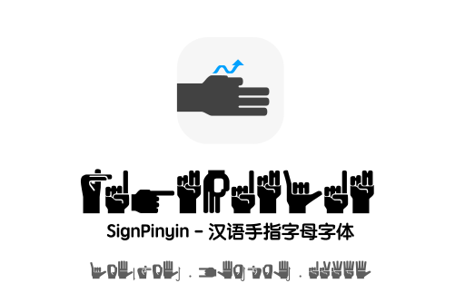

SignPinyin是一款汉语手指字母字体，用简洁的线条绘制出方便识别的手指字母。覆盖汉语拼音的各种拼写和特殊使用情况。

## 注意事项（使用前请阅读）

- 本字体基于[GF0021—2019《汉语手指字母方案》](http://www.moe.gov.cn/jyb_sjzl/ziliao/A19/201404/W020191101556565933988.pdf)制作。
- 本字体**不是手语字体**。在使用前，请确认您了解手指字母和手语的区别。
- 本字体大写字母为特殊手形，不符合手指字母方案，请谨慎使用。
- 合字特性受字符间距影响。如果您调整了字符间距，请着重核对`zh, ch, sh, ng` 显示是否正确。
- 请不要在任何严肃场合使用Italic样式。

## 特性

#### 字符集

- 支持全部汉语手指字母：`a-z, ẑ, ĉ, ŝ, ŋ, ê, ü`。
- 支持数字`0-9`。
- 支持若干大写字母特殊手形：`A, Q, T, X`。其余大写字基于小写字母有轻微调整，注重艺术表达。
- 支持Combining Diacritical Marks分区的四声调特殊字符：`<COMBINING MACRON>, <COMBINING ACUTE ACCENT>, <COMBINING CARON>, <COMBINING GRAVE ACCENT>`。
  - 注意：**不支持**不能与前文结合的独立`` ¯, ´, ˇ, ` ``符号。

#### 特殊规则

- 自动连接双字母：`zh, ch, sh, ng`。
- 快捷输入特殊手形：
  - `v' => ü`；
  - `u' => ü`。

- `ju, qu, xu`中`u`手型自动变为`ü`。
- 快捷输入声调（与Combining Diacritical Marks呈现方式略有不同）：`\1, \2, \3, \4`。
- 使用打断符号`\/`作为零宽空格，打断所有不应衔接的合字，如：山岗（`shan\/gang`）。
- 提供`3, 7, 8`的替换手形：
  - `onum`和`ss03`将`3`替换为`w`手形；
  - `ss01`将`7`替换为拇指、食指、中指伸直手形；
  - `ss02`将`7`替换为倒`l`手形，将`8`替换为拇指、食指、中指伸直手形。

## 样式

SignPinyin提供3种样式：

- Regular：第三人称右手视角；
- Left：第三人称左手视角；
- Italic：惊喜视角🤌。

注意：按字母顺序排序时，Left优先于Regular，因此软件默认调用的很可能是不太常见的左手视角。

## 下载

点击[Releases](https://github.com/ErSanSan233/SignPinyin/releases/)可获取字体文件，本字体仅有`ttf`格式。

## 软件

本字体的基本字形和Kerning由[Birdfont](https://birdfont.org)绘制，更多字体特性由[FontForge](https://fontforge.org)配置。

因此，请不要直接发布由Birdfont导出的字体。

## 更新日志

可惜的是，该字体更早期版本的bf和sfd文件都已经遗失。我们只能追溯到首次公开的0.5版本，并在此基础上更新。

注意：本字体最终定名为SignPinyin（小写y），但开发过程中曾命名为SignPinYin（大写Y）。这可能会带来字体名称冲突。若您在开发过程中测试过本字体，请您先卸载旧版本。

#### Regular

0.6：更新ch、CH、ĉ的手形为2019年后版本。

0.5：首次公开。

#### Left

0.6: 更新ch、CH、ĉ的手形为2019年后版本。

0.5：首次公开。

#### Italic

0.5：首次公开。

## 许可证

本字体的发布遵守 [SIL Open Font License v1.1](LICENSE)。

